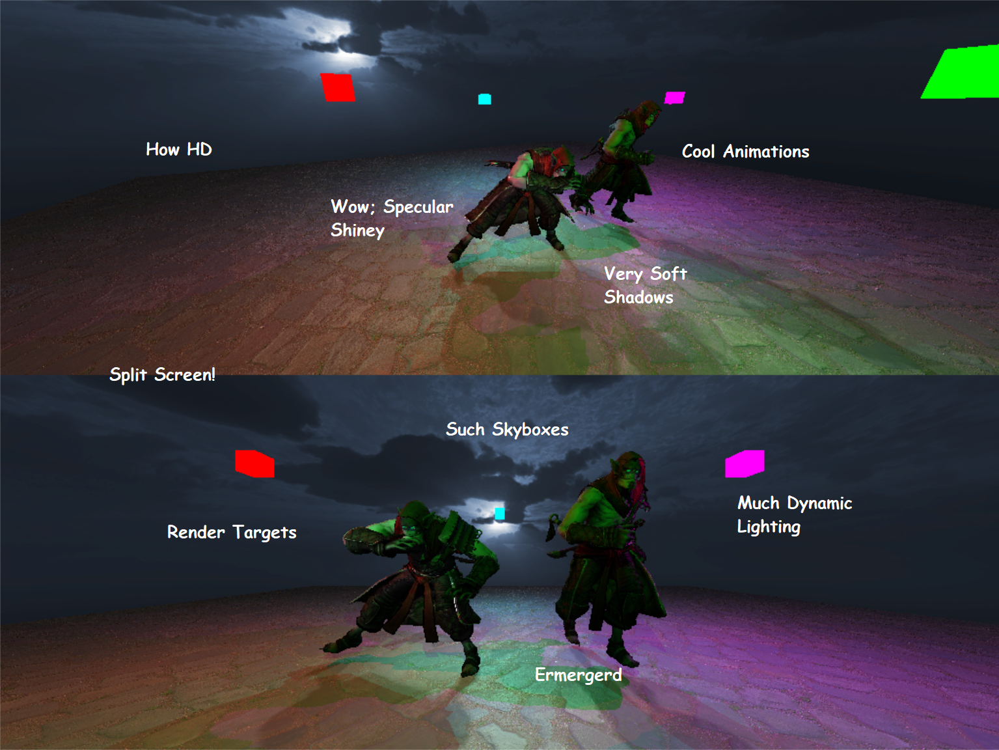

# PRE-3D
#### <em>A 3D Engine inspired from Game Engine Architecture by Jason Gregory</em>
<p align="center"></p>
<p align="center"><i>Pretty neat, huh.</i></p>

&emsp;&emsp;Hiya, this project is meant to be a ~~yet another~~ relatively-wholistic implementation of a 3D Game Engine,
facilitating all major application resposibilities ranging from entity-behaviour to rendering, physics and networking.

</br>
<p align="center">Thanks again for stopping by!</p>

## Quick Links
### Summary

[General](#general)

[Building](#building)

[Demo](#demo)

### Implementation
[Asset Management](#asset-management)

[Game Object](#game-object)

[Input](#input)

[Rendering](#rendering)

[Time](#time)

[Transform](#transform)

[Physics (In-Progress)](#physics)

# Summary
## General

The constituents of PRE-3D can be categorized into 2 primary levels; Core and Module.

### Core
- Consists of Subsystems and Components, all of which are fairly coupled to provide the unified Engine API.

### Module
- Provide decoupled, low-level functionalities which are highly cohesive to their respective domain (eg. the 
gameobject / component module knows nothing about the transform module).
- Each of the Core's Subsystems are built from one or more modules from this level. 

### Features
The following section highlights some notable features of PRE-3D thus far (in no particular order):
- Component-based Actor-model for entities
- Transform parenting system
- FPS control and frame time management
- Resource Management
- Skyboxes
- Multiple Camera Support
- Render Textures
- Dynamic lighting
- Post Processing Support
- Shadows, both directional and omni-directional
- Normal / Specular texture mapping
- Input management

## Building
The main project is developed using Visual Studio 2019, targetting x64 platforms.  
A copy of all project dependencies should already be included.  
Simply opening the solution file and selecting a build configuration should be all that's required (other than building the app itself).  

As expected of release configurations, the primary difference is omission of assertions and general sanity checks. Hence if something is borkt,
try a debug build and you'll ideally have your offending code identified. Debug also reports pesky memory leaks ;').

## Demo
<p align="center"></p>
<p align="center"><i>Please forgive my shoddy sense of humour</i> :joy:.</p>

A built x64 version of the current application main can be accessed via releases section [here](https://github.com/seenbeen/PRE-3D/releases/tag/v0.36-dev-demo).

If you're running on anything else, I don't have a convenient build for you (yet). Stay tuned.

#### Controls
- WASD + QE + Mouse for flycam controls
- Tab toggles between top and bottom split-screen
- O / P turns flashlight On / Off respectively

# Implementation
This section provides a deeper dive into implementation details.
- The engine is initialized via a number of config objects, a majority of which are currently blank.
- The application must provide `onInitialize` and `onShutdown` callbacks, which are invoked with the application context accordingly.
```cpp
#include <include/core.h> // all you need to access PRE-3D's Core level

using namespace PRE::Core; // for convenience

void OnInitialize(PREApplicationContext& applicationContext)
{
  // initialize scene, create RenderTextures, gameobjects, etc.
}

void OnShutdown(PREApplicationContext& applicationContext)
{
  // shutdown application; free up memory, deallocate objects
}

[...]

int main(int argc, char *argv[]) // important, SDL hooks into this "main declaration"
{
  // will run the app and return when everything's done
  PREApplication::Run(
    PREApplicationConfig(
      PREInputConfig(),
      PRERenderingConfig("A cool application", WINDOW_WIDTH, WINDOW_HEIGHT),
      PRETimeConfig(),
      PREWorldConfig(),
      PREAssetManagerConfig(ROOT_ASSET_PATH),
      OnInitialize,
      OnShutdown
    )
  );
}
```

## Asset Management
- Takes care of any resource-based asset management requiring loading from disk.
- Maintains resources using an LRU / size reference-based cache; will evict resources no longer being referenced upon insufficient memory.
- Objects obtained from the Asset Manager are freed from their respective subsystems no differently than if they were manually allocated.
- Currently Offers loading of: Models, Skeletons, Animations, Textures, Shaders.
```cpp
auto pShader = &assetManager.LoadShader(
  assetManager.rootAssetPath + "/vertexShader.vs",
  assetManager.rootAssetPath + "/fragmentShader.fs"
);
[...]
rendering.DestroyShader(*pShader); // also flags any associated shader files as freed to asset manager
```
## Game Object
- Component-based / Actor-model method of managing entities.
- The "blueprint" of a `GameObject` is described by a `GameObjectTemplate` (whose inheritting class defines what components it has).
- `GameObject`s are `Instantiate`d from the world subsystem using a `GameObjectTemplate` instance.
- `GameObjectComponent`s define behaviours for the standard Start, Update and Destroy.
- Subsystems can be accessed via component.
```cpp
class MyCoolComponent : public PREGameObjectComponent
{
protected:
  void OnStart() override { std::cout << "started" << std::endl; }
  void OnUpdate() override {
    if (GetInput().PREKEYCode::TAB)
    {
      Quit();
    }
  }
  void OnDestroy() override { std::cout << "dedded" << std::endl; }
};

[...]

class MyCoolObjectTemplate : public PREGameObjectTemplate
{
protected:
  void OnInstantiateTemplate() override
  {
    AddPREComponent<MyCoolComponent>();
  }
};

[...]

MyCoolObjectTemplate myCoolObjectTemplate;
auto pMyCoolObjectInstance = &world.Instantiate(myCoolObjectTemplate);
```
## Input
- Relatively standard input module offering access to window state (exit), keyboard state, mouse state, position, and motion.
```cpp
[...] // in PREGameObjectComponent
void OnUpdate() override
{
  if (GetInput().ApplicationHasQuit()) { Quit(); }
}
```
## Rendering
- Renders Models to RenderTextures using Cameras where the renderer's screenRenderTexture field renders to the window.
- Models, Cameras, Lights all have tags; only entities of the same tag will influence each other.
- RenderTargets have layer ids, where higher ids are rendered first (this allows for proper post-processing).
- Shadow casting can be selectively turned on / off per model.

```cpp
class CameraController : public PREGameObjectComponent
{
protected:
  void OnStart() override
  {
    _pSkyBox = &GetAssetManager().LoadSkyBox(
      GetAssetManager().rootAssetPath + SKY_BOX_RIGHT_PATH,
      GetAssetManager().rootAssetPath + SKY_BOX_LEFT_PATH,
      GetAssetManager().rootAssetPath + SKY_BOX_TOP_PATH,
      GetAssetManager().rootAssetPath + SKY_BOX_BOTTOM_PATH,
      GetAssetManager().rootAssetPath + SKY_BOX_FRONT_PATH,
      GetAssetManager().rootAssetPath + SKY_BOX_BACK_PATH
    );
    gameObject().GetComponent<PRECameraComponent>()->SetSkyBox(_pSkyBox);
  }

  void OnDestroy() override
  {
    GetRendering().DestroySkyBox(*_pSkyBox); // clean up
  }

private:
  PRESkyBox* _pSkyBox = nullptr;
};

class CameraGameObjectTemplate : public PREGameObjectTemplate
{
protected:
  void OnInstantiateTemplate() override
  {
    AddPREComponent<PRECameraComponent>(); // make sure camera component exists
    AddPREComponent<CameraController>();
  }
};

class CoolModelComponent : public PREGameObjectComponent
{
protected:
  void OnStart() override
  {
    auto& rendering = GetRendering();
    auto& assetManager = GetAssetManager();
    
    auto pModelRendererComponent = gameObject().GetComponent<PREModelRendererComponent>();
    
    // accepted file types are backed by Assimp
    _pMesh = &assetManager.LoadMesh(MESH_PATH);
    _pSkeleton = &assetManager.LoadSkeleton(SKELETON_PATH);

    _pMaterial = &rendering.CreateMaterial();
    
    _pShader = &assetManager.LoadShader(VERTEX_SHADER_PATH, FRAGMENT_SHADER_PATH);
    _pMaterial->SetShader(_pShader);
    
    _pTexture = &assetManager.LoadTexture(DIFFUSE_PATH);
    _pMaterial->SetTextureBinding(_pTexture, 1);
    
    pModelRendererComponent->SetMesh(_pMesh);
    pModelRendererComponent->SetSkeleton(_pSkeleton);
    pModelRendererComponent->SetMaterial(_pMaterial);
  }
  
  void OnDestroy() override
  {
    auto& rendering = GetRendering();
    rendering.DestroyTexture(*_pTexture);
    rendering.DestroyShader(*_pShader);
    rendering.DestroyMaterial(*_pMaterial);
    rendering.DestroySkeleton(*_pSkeleton);
    rendering.DestroyMesh(*_pMesh);
  }

private:
  PREMesh* _pMesh = nullptr;
  PRESkeleton* _pSkeleton = nullptr;
  PREMaterial* _pMaterial = nullptr;
  PREShader* _pShader = nullptr;
  PRETexture* _pTexture = nullptr;
};

class CoolModelTemplate : public PREGameObjectTemplate
{
protected:
  void OnInstantiateTemplate() override
  {
    AddPREComponent<PREModelRendererComponent>();
    AddPREComponent<CoolModelComponent>();
  }
};

class CoolLightTemplate : public PREGameObjectTemplate
{
protected:
  void OnInstantiateTemplate() override
  {
    AddPREComponent<PREDirectionalLightComponent>();
    // AddPREComponent<PREPointLightComponent>();
    // AddPREComponent<PRESpotLightComponent>();
  }
};

[...]

// initialize app, setting camera to target the screen
void OnInitialize(PREApplicationContext& applicationContext)
{
  CameraGameObjectTemplate cameraTemplate;
  auto& camera = applicationContext.world.Instantiate(cameraTemplate);
  auto pCameraComponent = camera.GetComponent<PRECameraComponent>();
  pCameraComponent->SetRenderTexture(&applicationContext.rendering.GetScreenRenderTexture());
  pCameraComponent->SetTag(0); // technically not necessary; default is 0
  
  CoolModelTemplate coolModelTemplate;
  auto& coolModel = applicationContext.world.Instantiate(coolModelTemplate);
  auto pCoolModelRendererComponent = coolModel.GetComponent<PREModelRendererComponent>();
  pCoolModelRendererComponent->SetTag(0); // see above
  pCoolModelRendererComponent->SetCastsShadows(true); // togglable shadows; default is true
  
  CoolLightTemplate coolLightTemplate;
  auto& coolLight = applicationContext.world.Instantiate(coolLightTemplate);
  coolLight.GetComponent<PREDirectionalLightComponent>()->SetTag(0); // see above
}
```

### Animation
- A component of the rendering subsystem that provides keyframe-interpolated transformation values.
- These "snapshots" are then assigned to the bones of a model to simulate animation.
- Supports blending between multiple animations.
- FSM animation state management.
```cpp
// in template
AddComponent<PREAnimatorComponent>();

[...]

// in start
// load our animation
auto pAnimation = assetManager.LoadAnimation(assetManager.rootAssetPath + animationPath, animationKey);

// create an animator FSM by defining individual states
PREAnimatorConfig animatorConfig;
animatorConfig.AddState(
  "default", // state name
  [](PREAnimatorComponent::Controller& controller)
  {
    // state behaviour; eg. if some condition is met, transition to another state
  },
  *pAnimation // the animation to play during the state
);

[...]

// create animator
auto pAnimator = &rendering.CreateAnimator(animatorConfig);

// attach animator
auto& animatorComponent = *GetComponent<PREAnimatorComponent>();
animatorComponent.SetAnimator(
  pAnimator, // animator
  "default", // starting state
  nullptr, // a void pointer to a context object if state behaviour needs external dependencies
  0.0f, // start time
  1.0f, // start speed
  false // is clamped (ie: stops animating at next cycle)
);

// bind the skeleton that will receive interpolated transforms
animatorComponent.SetSkeleton(modelSkeleton);
```
## Time
- Restricts and maintains FPS using linear regression.
- Provides the time the last frame took (deltaTime).
```cpp
[...] // in PREGameObjectComponent
void OnStart() override
{
  GetTime().SetFrameLimit(60); // restrict application to max 60 fps; ideally done during app init
}
void OnUpdate() override
{
  position += glm::vec3(1.0f) * GetTime().GetDeltaTime();
}
```
## Transform
- A `PRETransformComponent` is automagically added to every GameObject.
- Defines a "physical" state in the world for every object.
- Parent / children define a hierarchical representation for how objects relate to each other.
```cpp
[...] // in PREGameObjectComponent
void OnUpdate() override
{
  position += GetComponent<PRETransformComponent>()->GetForward() * GetTime().GetDeltaTime();
}
```
## Physics
In progress...
